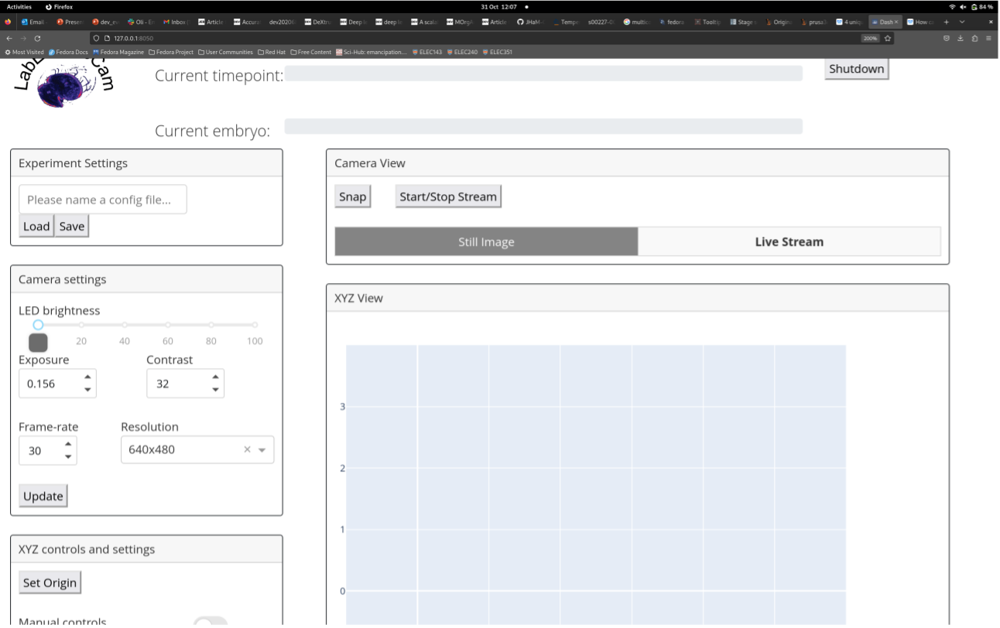
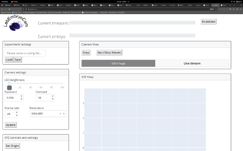
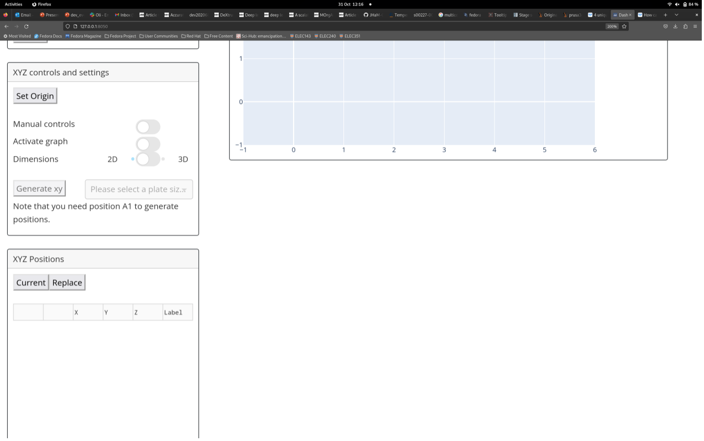
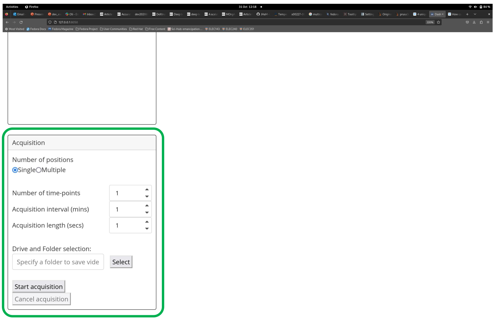

# LabEmbryoCam User Guide

#### ***An opensource platform for automated measurement of developing animals. The LabEmbryoCam is a project originating with the EmbryoPhenomics research group at the University of Plymouth, UK. It has been made possible by support from UKRI, NERC, BBSRC and Plymouth Science Park.***

-----------------
### INDEX
-----------------
* **1. Hardware setup**
* **2. Starting the webserver**
* **3. Homing the motorised XYZ stage**
* **4. Setting up camera and starting live stream**
* **5. Using manual controls to find and save desired positions**
* **6. Set acquisition parameters and start acquisition**
-----------------

***If you are using LabEmbryoCam, please consider joining the Google Group https://groups.google.com/g/labembryocam. Doing so will help contribute to the advancement of this opensource project, including staying up-to date with updates and receiving support.***

-----------------
### 1. HARDWARE SETUP
-----------------
The LEC is a versatile multidimensional imaging platform. A broad range of magnifications are possible, using different optical hardware, particularly lenses. 

The distance between the sample and the lens will depend on the magnification and lens characteristics. Similarly, the optimum distance between the sample and the light will depend on the optical hardware, magnification, but also the sample type.

The LEC was initially developed for dark field imaging of developing aquatic embryos. Dark field imaging, in which a black background is achieved via lighting arriving at the sample from an oblique angle, works well for imaging developing embryos.

-----------------
### 2. STARTING THE WEBSERVER
-----------------

Once you have powered on your system, you can start the LabEmbryoCam (LEC) webserver by double clicking the icon on the desktop or in the Activities panel:

A terminal window will automatically open followed by the browser with the webserver loaded. We can now proceed with getting the hardware set up for running an experiment.

-----------------
### 3. HOMING THE MOTORISED XYZ STAGE
-----------------
The first step required in setting up any experiment with the LEC is to home the XYZ stage. This is essential to ensure that the correct origin is used when finding and creating positions. To do this, click the `Set Origin` button in the user interface - you may have to scroll down the page to find it:

***Before homing the stage, make sure there are no objects that could obstruct the movement of the stage. Also, make sure not to use the app whilst the stage is homing as this could interfere with the process.***

-----------------
### 4. STARTING THE WEBSERVER
-----------------
On startup of the LEC webserver the camera is already initiated, however the default settings typically need to be adjusted to record good quality video. Adjusting the camera settings can simply be achieved using the `Camera Settings` section of the user interface: 

The following are descriptions for each camera setting:
* **Exposure**: The shutter speed at which the camera operates in milliseconds.
* **Contrast**: Contrast of the images acquired
* **Frame-rate**: The frame-rate at which videos are captured. Note that for high resolutions, such as 2048x2048, you will need to reduce exposure time below 10ms if you would like to achieve a frame-rate higher than 15-20fps. This is due to a hard limit set by the camera driver on raspberry pi.
* **Resolution**: Presets for resolution at which images will be captured.

***For changes to the camera settings to take effect you must press the `Update` button at the bottom of the Camera Settings section.***

On the right you will see section termed `Camera View`, here you can capture still images using the `Snap` button and start a live video stream using the `Start/Stop Stream` button:

Still images are interactive, so you can zoom in and out, and move the image to find an improved view. Before starting the next step, you may wish to start the live video stream for easily finding the animals or subjects you wish to record using the LEC.

***If you would like to change the camera settings you must exit the live stream before doing this so that your changes can take effect. Then when you have finished choosing your desired setttings, press the `Update` button before starting the live stream again.***

-----------------
### 5. USING MANUAL CONTROLS TO FIND AND SAVE POSITIONS
-----------------

The manual controls are entirely virtual and can be used as soon as the stage finishes homing. These can be found in the following section of the user interface:

The dropdown above the controls determines the distance the stage moves (*mm*) every time you press one of the arrows. 

In conjunction with the camera live video stream, move the stage using the manual controls to move the camera to a desired position. Once you have a position that you want, click the `Current` button in the xyz section to record the current position:

This will add a position entry into the position list. Note that all columns and rows in the table are editable. 

You can repeat this step until you have recorded all the positions you want. Once you have completed recording positions, the next step is to enter the parameters for the acquisition before starting the experiment. 

The following are descriptions for each of the controls and components in the XYZ controls and settings section of the user interface:

* **Set Origin**: Press this button to home the stage at startup of the user interface
* **Manual Controls**: Click this switch to enable or disable the joystick and Z-axis buttons on the system.
* **Activate graph**: Enabling this switch will allow you to click on positions on the graph and then the stage will move to the select position. This can be an easy way to double-check all your positions are correct whilst you have a live stream open.
* **Dimension**: Enabling this switch can switch between 2D (as shown above) or 3D view, 3D view can be useful for checking the z axis positions.
* **Generate XY**: Options and parameters for generating multi-well positions based on the coordinates at position ‘A1’.

The XYZ section provides functionality for creating lists of X, Y and Z positions.
* **Current**: Press this button to retrieve the coordinates of the current position where the stage is at. A new entry will be added into the position list below where it can be edited further.
* **Replace**: Press this button to replace the coordinates of the selected position with those at the current position of the stage. This can be used to update a position if an animal has moved or gone out of focus. Note that you must select a position in the position list via clicking on the circle icon in the second column of the position list for the position you’d like to replace.
* **Position list table**: Position list where coordinates are recorded. The first column is for removing position entries from the list, simply click the x icon for the position you’d like to remove. The second column is to permit selection of specific position entries for updating their coordinates. Finally, columns X, Y, Z and Label are all editable similar to an excel spreadsheet.

-----------------
### 6. SETTING AND STARTING ACQUISITIONS
-----------------

The acquisition parameters can be found at the bottom of the page of the user interface in the Acquisition section:

Here are descriptions for each acquisition parameter:
**Number of positions** - Whether you would like to capture footage for only the current position (‘Single’) or all the positions you have recorded (‘Multiple’).
**Number of timepoints** - How many acquisition iterations you would like the system to complete. An iteration consists of capturing footage for the specified positions. Setting the acquisition interval allows us to set this process to complete every X minutes, where X would be the acquisition interval
**Acquisition interval** - How long to wait between each timepoint in minutes.
**Acquisition length** - How long to capture video for each position, at each timepoint.
**Driver and Folder selection** - The full file path to the directory where you would like to save video. This can be selected using the Select button.

Once you have added in your desired acquisition parameters, you can now start an acquisition using the Start acquisition button!

